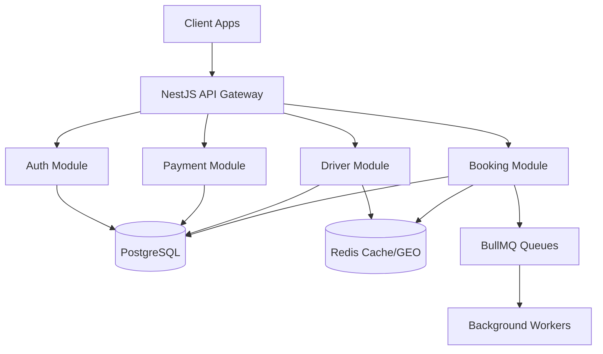

# Architecture

## High-Level Diagram

## Modular Monolith Pattern
We use a modular monolith to keep development simple while maintaining strict boundaries.

## Module Boundaries
- **Auth**: Manages user/driver authentication and JWTs.
- **Booking**: Core business logic for trips.
- **Driver**: Driver tracking and matching.
- **Payment**: Billing, wallets, and ledger.

## Inter-module Communication
Modules communicate via Dependency Injection (Services) and Event Emitter for decoupled reactions (e.g., booking created -> send notification).

## Future Microservice Extraction
Modules are self-contained. In the future, a module like Payment can be extracted into its own service, communicating via message broker instead of direct DI.
