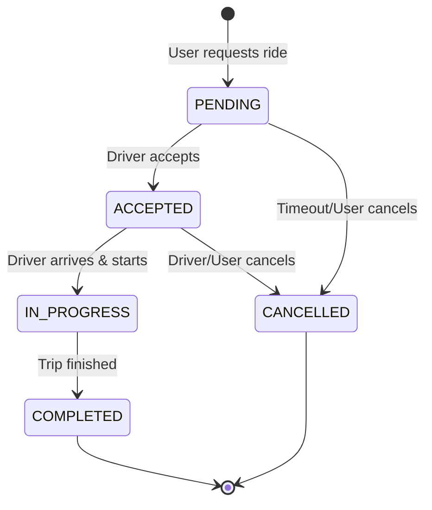

# Booking Flow

## Lifecycle

## Allowed Transitions
| Current State | Target State | Trigger |
|---------------|--------------|---------|
| PENDING | ACCEPTED | Driver match |
| PENDING | CANCELLED | User action / Timeout |
| ACCEPTED | IN_PROGRESS | Driver action |
| ACCEPTED | CANCELLED | User/Driver action |
| IN_PROGRESS | COMPLETED | Driver action |

## Cancellation Rules
- User can cancel for free before driver accepts.
- Cancellation fee applies if driver is en route.

## Driver Matching
See [Driver Matching Docs](./driver-matching.md)
