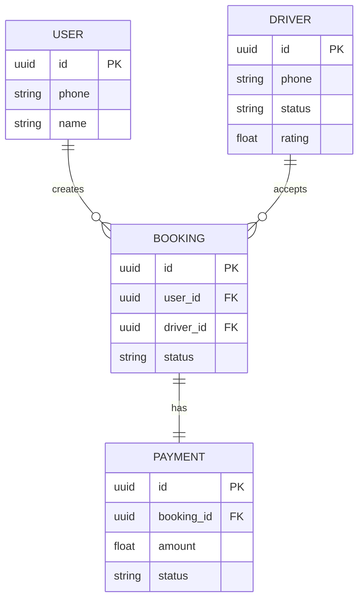

# Database Architecture

## ER Diagram

## Tables
- `User`: Customers.
- `Driver`: Drivers and vehicle info.
- `Booking`: Trip details.
- `Payment`: Transaction records.

## Key Indexes
- `Booking.status` for quick active trip lookups.
- `Driver.status` for finding available drivers.

## Transactions
We use Prisma interactive transactions (`prisma.$transaction`) for operations that span multiple tables (e.g., confirming a booking and creating a payment record).

## Migration Strategy
Prisma migrate is used. Always run `npx prisma migrate dev` in local and `npx prisma migrate deploy` in production.
