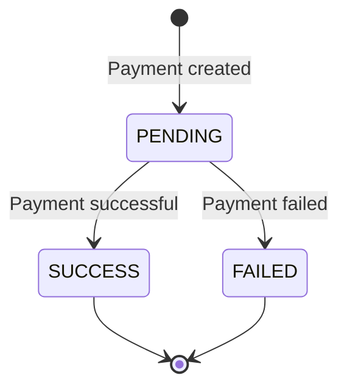

# Payment Flow

## Initiation
- Payments are initiated when a booking is completed.
- Supports Cash, Wallet, and Online Payment (Gateway).

## Webhooks
Payment gateways send webhooks to confirm online payments.
The webhook controller verifies the signature and updates the payment status.

## Idempotency
All payment webhooks and retries are idempotent. We check the `transaction_id` before processing to ensure we don't double-charge or double-credit.

## States

## Wallet/Ledger
Drivers and users have virtual wallets.
- **Driver Wallet**: Deducted for platform commission, credited for non-cash trips.

## Commission
Platform takes a fixed % commission on every completed ride, calculated automatically at the end of the booking.
